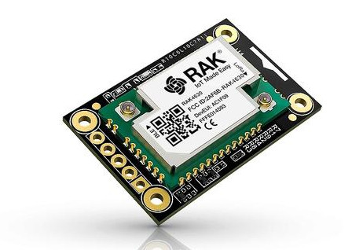
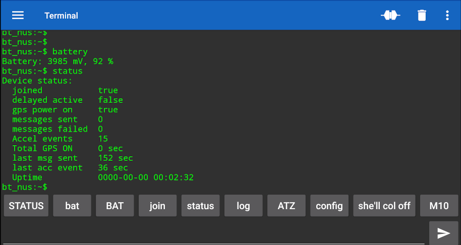

## Getting Started

Before getting started, make sure you have a proper Zephyr development
environment. You can follow the official
[Zephyr Getting Started Guide](https://docs.zephyrproject.org/latest/getting_started/index.html).

### Hardware
RAKWireless WisBlock Nordic nRF52840 BLE Core Module for LoRaWAN with LoRa SX1262 RAK4631 / RAK4631-R
https://docs.zephyrproject.org/latest/boards/arm/rak4631_nrf52840/doc/index.html



### Initialization

The first step is to initialize the workspace folder where the
`helium_mapper` and needed Zephyr modules will be cloned. You can do
that by running:

```shell
# initialize workspace for the helium_mapper (main branch)
west init -m https://github.com/retfie/helium_mapper --mr main helium_mapper_project
# update Zephyr modules
cd helium_mapper_project/helium_mapper
west update
```

### Build & Run

The application can be built by running:

```shell
west build -b rak4631_nrf52840 -s app
```

Once you have built the application you can flash it by running:

```shell
west flash
```

### Serial terminal

```shell
screen /dev/ttyACM0 115200
```
Press ENTER, and you will get unix like shell prompt.\
Press TAB to see all available commands.

```shell
uart:~$
  adc                battery            clear              config
  date               device             devmem             flash
  help               history            hwinfo             i2c
  kernel             location           log                lora
  lorawan            nrf_clock_control  reboot             resize
  sensor             shell              status

uart:~$ battery
Battery: 4245 mV, 100 %

uart:~$ sensor get temp@4000c000
channel idx=12 die_temp =  24.500000

uart:~$ status
Device status:
  joined           false
  delayed active   false
  gps power on     false
  messages sent    0
  messages failed  0
  Accel events     0
  Total GPS ON     0 sec
  last msg sent    178 sec
  last acc event   178 sec
  Uptime           0000-00-00 00:02:58
```

```shell
uart:~$ config
Device config:
  RAK4631 Helium mapper: v3.2.0-rc3-2-g83d4ca7ac8df
  Dev EUI          0011223344556677
  APP EUI          0011223344556677
  APP key          00112233445566778899aabbccddeeff
  Auto join        false
  Data rate/DR+    3
  Confirmed msgs   true
  Send interval    3600 sec
  Min delay        30 sec
  Max GPS ON time  300 sec
```

```shell
uart:~$ lorawan --help
lorawan - lorawan commands
Subcommands:
  dev_eui          :Get/set dev_eui [0011223344556677]
  app_eui          :Get/set app_eui [0011223344556677]
  app_key          :get/set app_key [00112233445566778899aabbccddeeff]
  auto_join        :Auto join true/false
  confirmed_msg    :Confirmed messages true/false
  send_interval    :Send interval in seconds
  min_delay        :Min delay between 2 messages in ms
  max_gps_on_time  :Max time GPS is ON if no one using it in seconds
```

Show dev_eui
```shell
uart:~$ lorawan dev_eui
dev_eui 0011223344556677
```

Set dev_eui
```shell
uart:~$ lorawan dev_eui 0123456789abcdef
uart:~$ lorawan dev_eui
dev_eui 0123456789ABCDEF

```

After set all LoRaWAN parameters, just reboot device to take them into effect:
```shell
uart:~$ reboot
```


```shell
...

[00:00:00.253,387] <inf> max7q: GPS enable gpio configured
[00:00:00.253,387] <inf> max7q: UART for GPS ready
[00:00:00.299,194] <inf> lis2dh: lis3dh@18: int2 on gpio@50000000.09
[00:00:00.301,300] <inf> lis2dh: fs=2, odr=0x4 lp_en=0x8 scale=9576
[00:00:00.359,832] <inf> fs_nvs: 8 Sectors of 4096 bytes
[00:00:00.359,832] <inf> fs_nvs: alloc wra: 7, f78
[00:00:00.359,863] <inf> fs_nvs: data wra: 7, 5ac
[00:00:00.393,463] <inf> hellium_mapper_ble: Starting Bluetooth NUS shell transport example
[00:00:00.396,148] <inf> hellium_mapper_ble: Bluetooth ready. Advertising started.
[00:00:00.397,399] <inf> helium_mapper: lis3dh@18: 0, -0.153216, 3.677184, -8.580096 (m/s^2)
[00:00:00.398,284] <inf> helium_mapper: Sampling at 10 Hz
[00:00:00.398,803] <inf> lis2dh: int2_ths=0x3 range_g=2 ums2=523597
[00:00:00.399,230] <inf> lis2dh: int2_dur=0x4
[00:00:00.401,062] <inf> helium_mapper_gps: max7q device is ready.
[00:00:00.401,092] <inf> helium_mapper_gps: gps trigger handler set
[00:00:00.401,092] <inf> helium_mapper: Joining network over OTAA
[00:00:05.880,859] <inf> lorawan: Joined network! DevAddr: 260bc520
[00:00:05.887,512] <inf> helium_mapper: New Datarate: DR_3, Max Payload 115
[00:00:05.887,542] <inf> lorawan: Datarate changed: DR_3
[00:00:05.887,603] <inf> helium_mapper: Waiting for events...
[00:00:34.837,524] <inf> helium_mapper: ACC trigger handler
[00:00:34.837,615] <inf> helium_mapper: Event ACC
[00:00:34.838,714] <inf> helium_mapper: lis3dh@18: 1, -1.072512, 8.426880, -12.870144 (m/s^2)
[00:00:34.838,775] <inf> helium_mapper: Event NMEA_TRIG_ENABLE
[00:00:34.838,775] <inf> max7q: GPS power ON
[00:00:34.838,806] <inf> max7q: NMEA Trigger: 1
[00:00:34.838,806] <inf> helium_mapper: GPS off timer start for 300 sec
[00:00:34.838,836] <inf> helium_mapper: Waiting for events...
[00:00:34.838,867] <inf> helium_mapper: Waiting for events...
[00:00:35.532,409] <inf> helium_mapper: ACC trigger handler

...

[00:02:43.177,642] <inf> helium_mapper: GPS trigger handler
[00:02:43.177,673] <inf> max7q: NMEA Trigger: 0
[00:02:43.177,734] <inf> helium_mapper: Event SEND
[00:02:43.182,525] <inf> helium_mapper: Lora send -------------->
[00:02:48.571,044] <inf> helium_mapper: Port 0, Pending 0, RSSI -42dB, SNR 11dBm
[00:02:48.577,941] <inf> helium_mapper: Data sent!
[00:02:48.577,972] <inf> helium_mapper: Waiting for events...

```

### Bluetooth terminal
To view, set and control over Bluetooth, use any application that supports The Nordic UART service UUID,
for example "Serial Bluetooth Terminal" for Android.



### Bluetooth serial console from PC
```
pip install ble-serial
ble-scan
Started general BLE scan

F1:44:8D:xx:xx:xx (RSSI=-48): Hellium_mapper
....
```

connect to device
```
ble-serial -d F1:44:8D:xx:xx:xx
16:29:56.569 | INFO | linux_pty.py: Port endpoint created on /tmp/ttyBLE -> /dev/pts/66
...
```

Open another console and open /tmp/ttyBLE (at 115200 for example) with screen, or other terminal program.
```
screen /tmp/ttyBLE 115200
uart:~$ config
Device config:
  RAK4631 Helium mapper: zephyr-v3.2.0-1753-g179de6d0d08c, Mar 20 2023 11:50:51
  Dev EUI          0011223344556677
  APP EUI          0011223344556677
  APP key          00112233445566778899aabbccddeeff
  Auto join        true
  Data rate/DR+    3
  Confirmed msgs   false
  Max failed msgs  120
  Inactive window  10800 sec
  Send interval    3600 sec
  Min delay        15 sec
  Max GPS ON time  300 sec
uart:~$
uart:~$ status
Device status:
  joined           true
  delayed active   false
  gps power on     false
  messages sent    19
  messages failed  0
  msg failed total 0
  Accel events     4
  Join retry sess  0
  Total GPS ON     5756 sec
  last msg sent    2034 sec
  last msg sent OK 2034 sec
  last acc event   4754 sec
  Uptime           0000-00-00 18:38:57
uart:~$
```

### RTT terminal
RTT console is supported and verified with J-link jtag adapter.

### Bootloader and DFU support
Update Zephyr modules
```
cd helium_mapper_project
west update
```

Build MCUboot loader with RTT support
```
west build --pristine -b rak4631_nrf52840 -d build_mcuboot_rak4631_nrf52840_dfu bootloader/mcuboot/boot/zephyr -- -DCONFIG_SIZE_OPTIMIZATIONS=y -DCONFIG_MULTITHREADING=y -DCONFIG_BOOT_USB_DFU_WAIT=y -DCONFIG_USE_SEGGER_RTT=y -DCONFIG_RTT_CONSOLE=y -DCONFIG_SERIAL=n -DCONFIG_UART_CONSOLE=n -DCONFIG_BOOT_USB_DFU_WAIT_DELAY_MS=10000
```

Flash bootloader
```
west flash -d build_mcuboot_rak4631_nrf52840_dfu --softreset -r nrfjprog
```
After this point, device has DFU capable bootloader, and during boot stays into this mode for 10sec before try to find valid image:

```
[2499323.353638] cdc_acm 1-2:1.0: ttyACM1: USB ACM device
[2499688.730597] usb 1-4.1: USB disconnect, device number 99
[2499693.211998] usb 1-4.1: new full-speed USB device number 101 using xhci_hcd
[2499693.342076] usb 1-4.1: New USB device found, idVendor=2fe3, idProduct=0100, bcdDevice= 3.02
[2499693.342086] usb 1-4.1: New USB device strings: Mfr=1, Product=2, SerialNumber=3
[2499693.342091] usb 1-4.1: Product: MCUBOOT
[2499693.342094] usb 1-4.1: Manufacturer: ZEPHYR
```

NOTE !!!
Device will try to boot from Slot-0, and it is empty. We must flash any MCUBOOT capable app into it!

build dfu capable app for Slot-0 \
add -DCONFIG_USB_DFU_REBOOT=y to automatically reboot after successfull image upload, or manually reboot device
```
cd helium_mapper
west build -b rak4631_nrf52840 -s app -- -DCONFIG_USB_DFU_REBOOT=y
west flash --hex-file build/zephyr/zephyr.signed.hex --softreset -r nrfjprog
```

If bootloader wasn't built with auto DFU reboot, please reboot device manually. Here is what dmesg should show:
```
[2501534.271778] usb 1-4.1: new full-speed USB device number 108 using xhci_hcd
[2501534.394713] usb 1-4.1: New USB device found, idVendor=2fe3, idProduct=0100, bcdDevice= 3.02
[2501534.394726] usb 1-4.1: New USB device strings: Mfr=1, Product=2, SerialNumber=3
[2501534.394730] usb 1-4.1: Product: MCUBOOT
[2501534.394734] usb 1-4.1: Manufacturer: ZEPHYR
[2501544.770625] usb 1-4.1: USB disconnect, device number 108
[2501545.000203] usb 1-4.1: new full-speed USB device number 109 using xhci_hcd
[2501545.122567] usb 1-4.1: New USB device found, idVendor=2fe3, idProduct=0100, bcdDevice= 3.02
[2501545.122579] usb 1-4.1: New USB device strings: Mfr=1, Product=2, SerialNumber=3
[2501545.122583] usb 1-4.1: Product: Zephyr DFU Helium Mapper
[2501545.122586] usb 1-4.1: Manufacturer: ZEPHYR
[2501545.188662] cdc_acm 1-4.1:1.0: ttyACM0: USB ACM device
```

From this point you will have MCUboot capable device, and any new version of app could be uploaded via DFU.\
( Just make sure that it has mcuboot support and mcuboot shell capabilities, to confirm any new image uploaded ).

Build new version and upload it with DFU util into slot-1:
```
dfu-util --alt 1 -d 2fe3:0100 --download build/zephyr/zephyr.signed.bin
dfu-util 0.9

Copyright 2005-2009 Weston Schmidt, Harald Welte and OpenMoko Inc.
Copyright 2010-2016 Tormod Volden and Stefan Schmidt
This program is Free Software and has ABSOLUTELY NO WARRANTY
Please report bugs to http://sourceforge.net/p/dfu-util/tickets/

dfu-util: Invalid DFU suffix signature
dfu-util: A valid DFU suffix will be required in a future dfu-util release!!!
Opening DFU capable USB device...
ID 2fe3:0100
Run-time device DFU version 0110
Claiming USB DFU Runtime Interface...
Determining device status: state = appIDLE, status = 0
Device really in Runtime Mode, send DFU detach request...
Device will detach and reattach...
Opening DFU USB Device...
Claiming USB DFU Interface...
Setting Alternate Setting #1 ...
Determining device status: state = dfuIDLE, status = 0
dfuIDLE, continuing
DFU mode device DFU version 0110
Device returned transfer size 128
Copying data from PC to DFU device
Download        [=========================] 100%       345272 bytes
Download done.
state(4) = dfuDNBUSY, status(0) = No error condition is present
Done!
```

Reboot device manually via reset if CONFIG_USB_DFU_REBOOT=y not used.


Once new image boots, open serial console to device, and use mcuboot command to confirm new image if its OK, and then reboot device to verify that new image is loaded.
```
mcuboot confirm
reboot
```

Example output from device serial console:
```
uart:~$ mcuboot
swap type: revert
confirmed: 0

primary area (1):
  version: 0.0.0+0
  image size: 344424
  magic: good
  swap type: test
  copy done: set
  image ok: unset

secondary area (2):
  version: 0.0.0+0
  image size: 344424
  magic: unset
  swap type: none
  copy done: unset
  image ok: unset
[00:01:12.956,359] <inf> mcuboot_util: Swap type: revert

uart:~$ mcuboot confirm

uart:~$ mcuboot
swap type: none
confirmed: 1

primary area (1):
  version: 0.0.0+0
  image size: 344424
  magic: good
  swap type: test
  copy done: set
  image ok: set

secondary area (2):
  version: 0.0.0+0
  image size: 344424
  magic: unset
  swap type: none
  copy done: unset
  image ok: unset
[00:01:40.986,907] <inf> mcuboot_util: Swap type: none
```

Note! In case new image not confirmed, or fails to boot, it will automatically revert to last working image into slot-0
